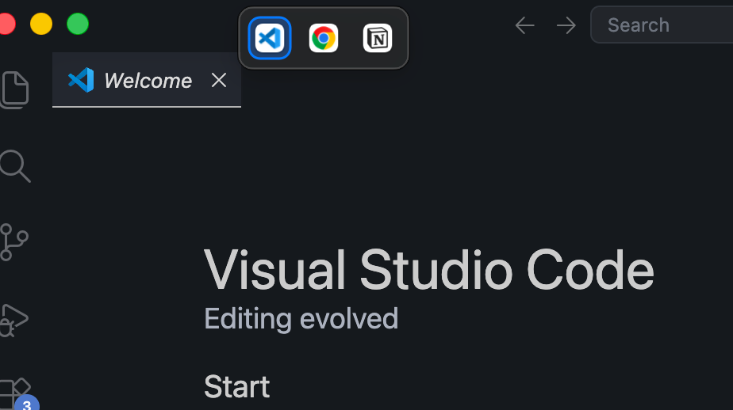

# Yabai Stack Switcher

A small macOS app that shows a floating icon switcher on top of
[yabai](https://github.com/koekeishiya/yabai) window stacks. Each stacked window
gets an icon; click one to instantly focus that window. The bar sits at the
top-left of the stack and can be dragged horizontally to wherever you like.

<p align="center"><em>The focused window is highlighted with an accent ring.</em></p>

<!-- TODO: replace with an overview screenshot -->
<p align="center">
  
</p>

## Features

- **One icon per stacked window** — uses each app's own icon.
- **Click to switch** — focus the window you clicked, instantly.
- **Hover to preview** — rest the mouse on an icon and a live preview of that
  window pops up above the bar so you can tell stacked windows apart before
  clicking.
- **Right-click to unstack** — pop a window out of its stack. On a `stack`-layout
  space the window is floated, resized to 50% of the stack area, and centered so
  it's obvious it was removed. On a `bsp`-layout space with a stack node, the
  window is warped to a non-stacked sibling and stays managed.
- **Middle-click to close** — close the window behind the icon in one click.
- **Drag horizontally** — grab the bar and slide it left/right; it stays where
  you put it and stays clamped to the screen edges.
- **Focused-window highlight** — an accent ring marks the current window.

<!-- TODO: replace with a screenshot of the focused-window accent ring -->
<p align="center">
  
</p>

- **Appears instantly** — driven by yabai signals, not polling, so the bar shows
  up ~120 ms after you switch to a stack's space.
- **One bar per stack** — on every display, wherever you have stacks.
- **Create Stack Mode** — hold **Shift** while dragging a yabai window to light up
  a "Create Stack Mode" indicator and outline every other window on the space as a
  drop target. The target under your cursor is emphasized with a center drop-zone
  ring; release on a target's center and yabai stacks the windows. Works alongside
  yabai's normal drag-to-swap (no Shift = swap as usual).
- **Menu bar icon** — a small icon in the menu bar gives you a context menu to
  open **Settings…** or **Quit** the app without reaching for Activity Monitor.
- **Stays out of the way** — no Dock icon, never steals keyboard focus, and the
  bar background is click-through so you can still click the traffic-light
  buttons of the window underneath.
- **No special permissions** — doesn't require Accessibility or SIP changes; it
  only talks to yabai via its message API.

## Requirements

- macOS 12 or later
- [yabai](https://github.com/koekeishiya/yabai) v7+ installed and running

## Install

### Option A — Homebrew (recommended)

```sh
brew tap YOUR_GITHUB_USER/tap
brew install --cask yabai-stack-switcher
```

This also installs yabai if you don't have it (the cask declares it as a
dependency). To upgrade later:

```sh
brew upgrade --cask yabai-stack-switcher
```

### Option B — Pre-built release

Download the latest `YabaiStackSwitcher-<version>.zip` from
[Releases](../../releases), unzip, drag the `.app` to `/Applications`, and
double-click.

## Start at login

Add `YabaiStackSwitcher.app` to
**System Settings → General → Login Items & Extensions → Login Items**.

## Usage

1. Make sure yabai is running and you have at least two windows stacked on the
   same space.
2. Switch to that space — the icon bar appears at the top-left of the stack.
3. **Click** an icon to focus that window.
4. **Right-click** an icon to remove it from the stack.
5. **Middle-click** an icon to close the window.
6. Drag the bar horizontally to reposition it; the position persists while the
   app runs.

### Right-click: remove from stack

Right-clicking an icon pops that window out of its stack. The behavior depends
on the space's layout (run `yabai -m query --spaces --space | jq .type` to
check):

- **`stack`-layout space** — the window is floated, resized to 50% of the
  original stack area, and centered within it. This makes it visually obvious
  the window was unstacked. The window is no longer managed by yabai (it's
  floating), since yabai can't keep a single window managed on its own in a
  stack-type space.
- **`bsp`-layout space** — the window is warped (`yabai -m window <id> --warp
  <sibling>`) onto a non-stacked sibling on the same space. It stays managed by
  yabai and becomes a normal bsp split. If no suitable sibling exists, the
  window is floated as a fallback.

<!-- TODO: replace with a screenshot of right-click unstack on a stack-type space -->
<p align="center">
  
</p>

### Middle-click: close window

Middle-click an icon to close that window (`yabai -m window --close <id>`). The
bar updates automatically as yabai reports the window destroyed.

### Menu bar icon

The app puts a small stack icon in the macOS menu bar. Click it for a context
menu:

- **Settings…** — adjust the bar's horizontal/vertical offset from the
  stack's top-left corner. Values are remembered across launches.
- **Quit Yabai Stack Switcher** — close the app (also bound to ⌘Q).

<!-- TODO: replace with a screenshot of the menu bar icon and its context menu -->
<p align="center">
  
</p>

### Create Stack Mode

Hold **Shift** while you drag a yabai window to enter Create Stack Mode:

1. Press and hold **Shift**, then drag a window with yabai's normal move modifier
   (Option by default).
2. A "Create Stack Mode" badge appears at the top of the screen and every other
   window on the space is outlined as a drop target.

<!-- TODO: replace with a screenshot of Create Stack Mode with outlines -->
<p align="center">
  
</p>

3. The target under your cursor is emphasized and shows a center drop-zone ring —
   that ring marks where yabai will accept a stack drop.

<!-- TODO: replace with a screenshot of the active drop-zone ring -->
<p align="center">
  
</p>

4. Release the window over a target's center ring; yabai stacks the two windows.
5. Release **Shift** (or stop dragging) and the overlays disappear.

Stacking itself is handled by yabai's native drop-on-center behavior — the app
only adds the visual mode and target highlighting. Without Shift, dragging
behaves exactly as yabai normally does (swap, not stack).

### Stacking windows in yabai

If you're new to yabai stacking, you can stack windows by dragging one onto the
center of another, or via yabai messages:

```sh
yabai -m window --stack next      # stack the focused window onto the next one
yabai -m window --focus stack.next   # cycle within a stack (keyboard)
```

This app gives you a clickable alternative to the keyboard commands — and
**right-clicking** an icon is the easy way to unstack a window without dropping
to the terminal.

## yabai signals

On launch the app registers yabai signals (labelled `yss-*`) so it updates the
moment windows change. These are automatically cleaned up when the app quits. If
the app is force-killed, stale signals are reclaimed on the next launch. You can
inspect them at any time:

```sh
yabai -m signal --list             # look for yss-* labels
```

## Troubleshooting

**The bar doesn't appear.**
- Confirm yabai is running: `yabai -m query --windows` should print JSON.
- Confirm you have a stack (≥ 2 windows with `stack-index > 0`) on the visible
  space: `yabai -m query --windows | jq '[.[] | select(."stack-index" > 0)]'`
- The bar only shows for stacks on the **currently visible** space.

**The bar appears but clicking doesn't switch windows.**
- Make sure the app is still running. It registers as an accessory (no Dock
  icon), so check the menu bar icon, Activity Monitor, or
  `pgrep -f YabaiStackSwitcher`.

**Stale signals after a crash.**
- Just relaunch the app — it removes any orphaned `yss-*` signals before
  re-registering.

## Uninstall

1. Quit the app via the menu bar icon → **Quit**, or
   `pkill -f YabaiStackSwitcher`.
2. Remove it from Login Items if you added it.
3. Delete `YabaiStackSwitcher.app`.

Any yabai signals are removed automatically on quit.

## License

MIT
